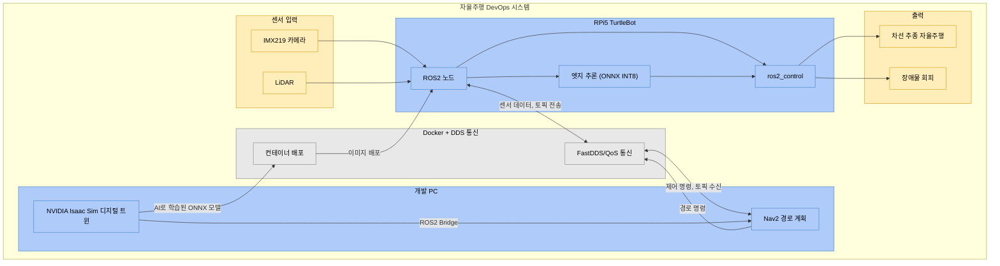

# Docker와 NVIDIA Isaac Sim을 활용한 자율주행 DevOps 체계 구축 및 AI 기반 Sim-to-Real 로봇 제어

## 시스템 블록도

---

## 각 블록 설명

### 1. 센서 입력

RPi5 TurtleBot에 장착된 물리 센서들이 실제 환경 정보를 수집

**IMX219 카메라**: 차선 인식 AI 모델의 입력 데이터로 사용

**LiDAR**: Nav2 경로 계획, 장애물 회피에 필요한 데이터 제공

---

### 2. RPi5 TurtleBot

센서 데이터를 받아 판단하고 모터를 제어

**ROS2 노드**: 전체 시스템의 통신 허브 - 센서 데이터를 표준 ROS2 토픽으로 변환하여 내부 노드와 외부 PC 모두에 전달

**ros2_control**: Dynamixel 모터를 ROS2 표준 인터페이스로 제어하는 하드웨어 추상화 계층

---

### 3. Docker + DDS 통신

환경 일치와 실시간 데이터 전송을 담당

**컨테이너 배포**: Docker Buildx를 이용해 x86_64(PC)와 ARM64(RPi5) 두 아키텍처용 이미지를 동시에 빌드합니다. Docker Hub를 통해 PC에서 학습 완료된 AI 모델과 설정 파일이 포함된 컨테이너를 RPi5에 원격 배포

**FastDDS/QoS 통신**: PC와 RPi5 사이의 무선 네트워크 환경에서 ROS2 토픽 데이터를 실시간 전송, QoS(Quality of Service) 프로필을 통해 대용량 카메라 이미지와 LiDAR 데이터의 전송 지연을 최소화하고 통신 안정성을 확보

---

### 4. 개발 PC

시스템의 핵심 연산을 수행

**NVIDIA Isaac Sim 디지털 트윈**: 실제 TurtleBot과 동일한 물리 파라미터(질량, 관성, 마찰력)를 가진 가상 로봇을 구현

**Nav2 경로 계획**: ROS2 Navigation2 프레임워크로 로봇의 전역/지역 경로를 계획

---

### 5. 출력

**차선 추종 자율주행**: AI 모델이 인식한 차선 위치를 기반으로 차선 중앙을 따라 주행

**장애물 회피**: LiDAR 데이터와 Nav2 경로 계획기가 협력하여 전방 장애물을 감지하고 안전한 경로로 우회.

---

## 전체 데이터 흐름

### 실시간 주행 루프

전체 시스템이 가동되면 다음과 같은 순환 루프가 실시간으로 작동합니다.

1. **센서 → RPi5**: IMX219 카메라와 LiDAR가 환경 데이터를 수집하여 ROS2 노드에 전달
2. **RPi5 내부 처리**: ROS2 노드가 카메라 영상을 엣지 추론 노드로 넘기면, ONNX INT8 모델이 실시간으로 차선 위치를 추론
3. **RPi5 ↔ PC 통신**: 센서 데이터가 FastDDS를 통해 PC로 전송되고, PC의 Nav2가 전역 경로를 계산하여 제어 명령 전송
4. **모터 제어 → 출력**: ros2_control이 AI의 차선 추종 명령과 Nav2의 경로 명령을 종합하여 Dynamixel 모터를 구동 및 로봇이 차선을 따라가며 장애물을 회피

### 개발·배포 파이프라인

실시간 주행 루프와 별도로, 모델 개선과 배포가 다음 경로로 이루어집니다.

1. **시뮬레이션 데이터 생성**: Isaac Sim에서 Domain Randomization을 적용한 합성 데이터를 생성
2. **AI 모델 학습**: 합성 데이터 + 실제 주행 이미지로 YOLOv8 차선 인식 모델을 학습
3. **모델 최적화**: PyTorch → ONNX 변환 → INT8 양자화를 거쳐 RPi5에서 실행 가능한 경량 모델 제작
4. **컨테이너 배포**: 최적화된 모델이 포함된 Docker 이미지를 빌드하여 Docker Hub에 푸시하고, RPi5가 이를 Pull하여 즉시 적용

### Sim-to-Real 검증 사이클

시뮬레이션과 실제 환경 사이의 괴리(Reality Gap)를 줄이기 위해 다음 과정을 반복합니다.

1. Isaac Sim에서 가상 로봇으로 자율주행을 테스트
2. 실제 RPi5 TurtleBot에 동일한 코드를 배포하여 실주행 테스트를 수행
3. 가상과 실제의 센서 오차(렌즈 왜곡, 물리 마찰력 등)를 측정하여 시뮬레이션 파라미터를 보정
4. 보정된 시뮬레이션에서 다시 검증