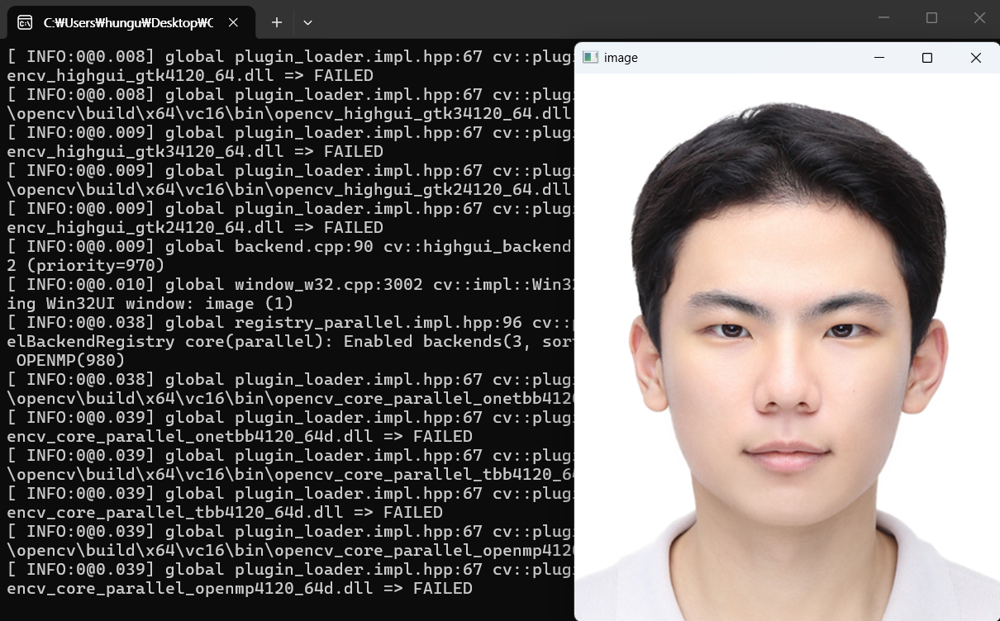

# ch 2-2 OpenCV 설치와 기초 사용법

## 1. 비주얼 스튜디어 프로젝트 속성에서 Debug 모드, Release 모드의 차이

비주얼 스튜디오에서 프로젝트를 빌드할 때 선택할 수 있는 두 가지 구성(Configuration)으로, 개발 단계와 배포 단계에서 각각 다른 목적에 최적화되어 있다.

Debug 모드 : **개발 및 디버깅 단계**에서 사용하는 빌드 구성

Release 모드 : **최종 배포 단계**에서 사용하는 빌드 구성

### 비교 요약

| 비교 항목 | Debug 모드 | Release 모드 |
| --- | --- | --- |
| **목적** | 개발 및 디버깅 | 최종 배포 |
| **컴파일러 최적화** | 비활성화 (`/Od`) | 활성화 (`/O2`) |
| **디버그 정보** | 전체 포함 (PDB) | 최소 또는 없음 |
| **런타임 검사** | 활성화 | 비활성화 |
| **런타임 라이브러리** | 디버그 버전 (`/MDd`) | 릴리스 버전 (`/MD`) |
| **매크로** | `_DEBUG` 정의 | `NDEBUG` 정의 |
| **실행 속도** | 느림 | 빠름 |
| **파일 크기** | 큼 | 작음 |
| **OpenCV 라이브러리** | `opencv_world4100d.lib` | `opencv_world4100.lib` |

---

## 2. 비주얼 스튜디오 프로젝트 속성에서 x86 모드와 x64 모드의 차이

비주얼 스튜디오에서 선택하는 플랫폼(Platform) 설정으로, 생성되는 실행 파일의 CPU 아키텍처를 결정한다.

### 2.1 x86 모드 (32비트)

- **대상 아키텍처**: Intel/AMD 32비트(IA-32) 프로세서용 코드를 생성
- **메모리 주소 공간**: 프로세스당 최대 약 4GB(2^32)의 가상 메모리를 사용할 수 있다. 실제로는 운영체제가 일부를 사용하므로 사용자 공간은 약 2GB로 제한된다.
- **포인터 크기**: 4바이트(32비트)이다.
- **호환성**: 32비트 및 64비트 Windows 모두에서 실행 가능

### 2.2 x64 모드 (64비트)

- **대상 아키텍처**: Intel/AMD 64비트(x86-64, AMD64) 프로세서용 코드를 생성
- **메모리 주소 공간**: 프로세스당 이론상 최대 16EB(2^64)의 가상 메모리를 사용할 수 있다. Windows에서 실제 제한은 약 8TB~128TB이다.
- **포인터 크기**: 8바이트(64비트)이다.
- **호환성**: 64비트 Windows에서만 실행 가능

### 2.3 비교 요약

| 비교 항목 | x86 (32비트) | x64 (64비트) |
| --- | --- | --- |
| **포인터 크기** | 4바이트 | 8바이트 |
| **최대 메모리** | ~2GB (사용자 공간) | ~8TB 이상 |
| **범용 레지스터** | 8개 (32비트) | 16개 (64비트) |
| **실행 환경** | 32비트/64비트 OS 모두 | 64비트 OS만 |
| **대규모 데이터 처리** | 메모리 제한으로 불리 | 대용량 처리에 유리 |
| **라이브러리 경로** | `opencv/build/x86/vc16/lib` | `opencv/build/x64/vc16/lib` |

---

## 3. 빌드 전에 비주얼 스튜디어에서 포함 디렉터리(Include Directories) 설정 이유

### 3.1 포함 디렉터리란?

포함 디렉터리는 컴파일러가 `#include` 전처리 지시문에서 참조하는 **헤더 파일(.h, .hpp)을 검색할 경로 목록**이다.

### 3.2 설정이 필요한 이유

소스코드에서 외부 라이브러리의 헤더 파일을 포함할 때, 컴파일러는 해당 파일의 위치를 알아야 하기 때문에 OpenCV 설치 경로(예: `C:\opencv\build\include`)에서 포함 디렉터리를 설정하여 컴파일러가 헤더 파일을 찾도록 한다.

---

## 4. 빌드 전에 비주얼 스튜디오에서 라이브러리 디렉터리(Library Directories) 설정 이유

### 4.1 라이브러리 디렉터리란?

라이브러리 디렉터리는 링커가 **라이브러리 파일(.lib)을 검색할 경로 목록**이다.

### 4.2 설정이 필요한 이유

컴파일이 완료된 후 링크 단계에서, 링커는 오브젝트 파일에서 호출된 외부 함수의 실제 구현을 라이브러리 파일에서 찾아 연결해야 한다. 이때 링커가 라이브러리 파일의 위치를 모르면 다음과 같은 **링크 에러**가 발생한다.

---

## 5. 빌드 전에 비주얼 스튜디오에서 링커 추가 종속성(Additional Dependencies) 설정 이유

### 5.1 추가 종속성이란?

추가 종속성은 링커가 링크해야 할 **구체적인 라이브러리 파일의 이름**을 지정하는 설정이다.

위에서 설정한 라이브러리 디렉터리는 경로를 통해 어디에서 찾을 것인지를 지정하는 반면 추가 종속성은 파일명을 통해 무엇을 찾을 것인가를 지정

### 5.2 설정이 필요한 이유

라이브러리 디렉터리에 수십, 수백 개의 `.lib` 파일이 존재할 수 있다. 링커는 그 중 프로젝트에 실제로 필요한 라이브러리가 어떤 것인지 자동으로 판단하지 못하므로 개발자가 명시적으로 필요한 라이브러리 파일명을 지정해야 한다.

### 빌드 설정 3단계 요약

빌드가 성공하기 위한 세 가지 설정의 관계를 정리하면 다음과 같다.

```
[1단계 - 컴파일]
  포함 디렉터리 → 헤더 파일 위치 → 컴파일러가 함수 선언을 확인

[2단계 - 링크]
  라이브러리 디렉터리 → .lib 파일 검색 경로 → "어디서" 찾을지
  추가 종속성        → .lib 파일 이름      → "무엇을" 링크할지

[3단계 - 실행]
  시스템 Path        → .dll 파일 검색 경로 → 런타임 로드
```

---

## 6. DLL 사용을 위해 시스템 환경변수 Path에 추가하는 경로는 무엇이고 왜 추가해야하는지 설명

### 6.1 추가해야 하는 경로

DLL 파일이 위치한 디렉터리 경로를 시스템 환경변수 Path에 추가

```
C:\opencv\build\x64\vc16\bin
```

이 경로에는 `opencv_world4100.dll` , `opencv_world4100d.dll` 등의 동적 라이브러리 파일이 존재한다.

### 6.2 추가해야 하는 이유

프로그램의 빌드(컴파일 + 링크)가 성공하더라도, 동적 라이브러리를 사용하는 프로그램은 **실행 시점**에 해당 DLL 파일을 찾아 메모리에 로드해야 한다. 

## 7. 자신의 사진 파일을 화면에 출력하는 프로그램 작성

- 소스 코드

```cpp
#include "opencv2/opencv.hpp"
#include <iostream>
using namespace cv;
using namespace std;

int main() {
	cout << "Hello OpenCV " << CV_VERSION << endl;
	Mat img;
	img = imread("myphoto.jpg");
	if (img.empty()) {
		cerr << "Image load failed!" << endl;
		return -1;
	}
	namedWindow("image");
	imshow("image", img);
	waitKey();
	return 0;
}
```

- 실행 결과

